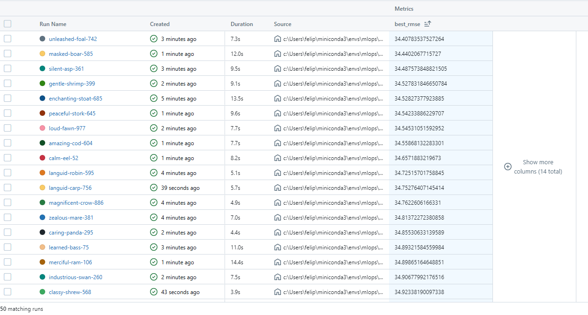
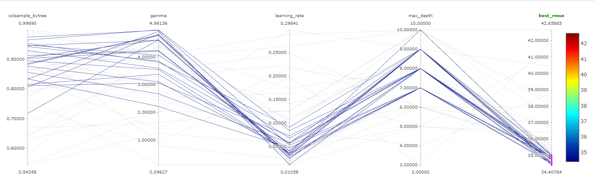

# Regressão - Prever a Demanda de Bicicletas

## Objetivo do Projeto
O objetivo do projeto está em demonstrar a habilidade na utilização de ferramentas de Data Science.

## Ferramentas Utilizadas
- **Cross Validation:**: Técnica utilizada para determinar qual algoritmo baseado em árvore de decisão apresenta a melhor performance nos dados de treino.
- **Optuna**: Utilizado para otimização dos hiperparâmetros dos modelos de Machine Learning.
- **XGBoost**: Algoritmo Ensemble de Gradient Boosting para realizar as previsões.
- **MLflow**: Ferramenta para gerenciar e registrar todas as trials e experimentos realizados durante o processo de otimização e treinamento dos modelos.

## MLflow Imagens

MLflow Runs: 

MLflow Compare 50 experimentos: 

